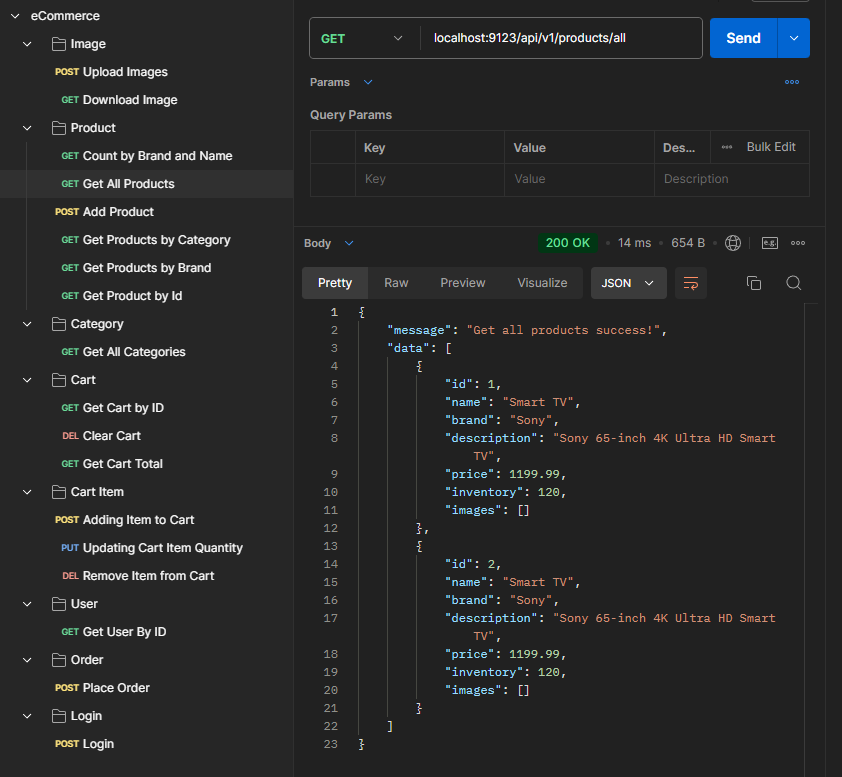

# eCommerce API

This is a Spring-based RESTful API for an eCommerce platform that manages products, categories, images, and a shopping cart. It supports product listing, filtering, image uploading/downloading, and more.

## Features

- **Product Management**: Add, list, and filter products by category, brand, and name.
- **Image Upload/Download**: Upload images for products and download them using a product ID.
- **Category Management**: Retrieve all available product categories.
- **Cart Operations**: (Additional cart operations can be listed here when implemented).

## Tech Stack

- **Java**
- **Spring Boot**: Backend framework for building the API
- **Hibernate**: ORM for database interaction
- **Spring Security**: Authentication and authorization
- **Maven**: Dependency management
- **MySQL**: for storing data
- **Postman**: Used for testing all API endpoints

## Main Endpoints

- **Image Management**: Upload and download images for products.
- **Product Management**: Add new products, list all products, and filter products by category, brand, or name.
- **Category Management**: Retrieve all product categories.
- **Cart**: Manage shopping cart operations.

## Running the API

1. Clone the repository.
2. Ensure Java and Spring Boot are installed.
3. Set up necessary dependencies (e.g., Hibernate, Spring Security if required).
4. Run the application using.

